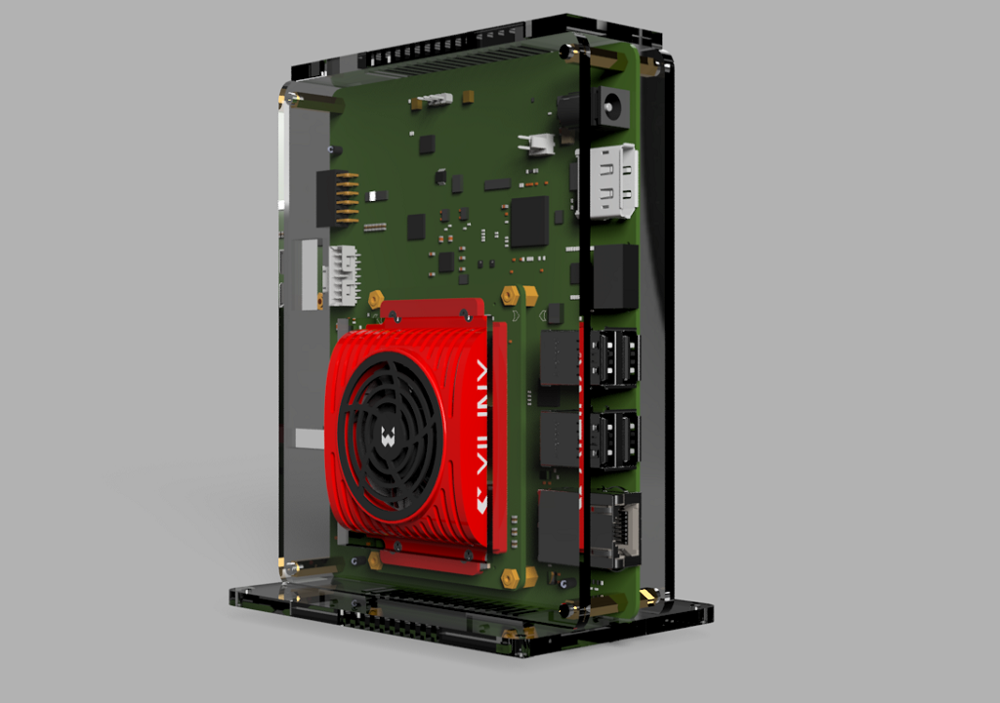
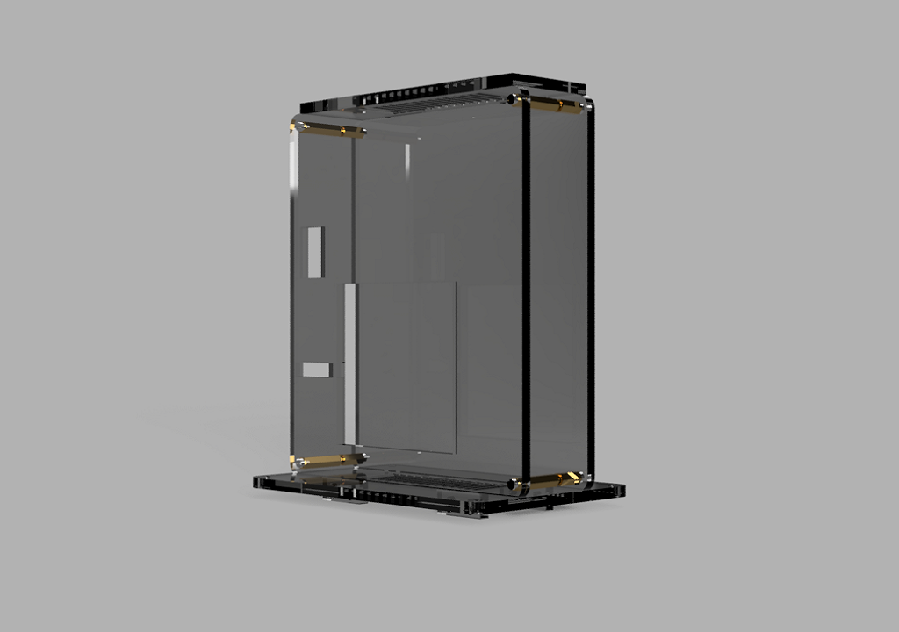
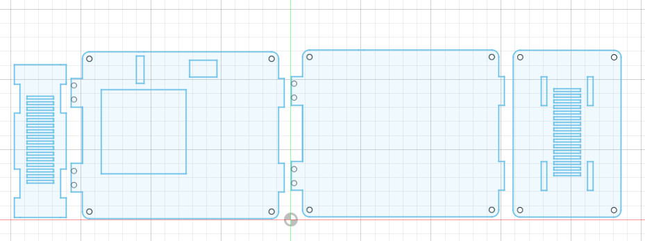
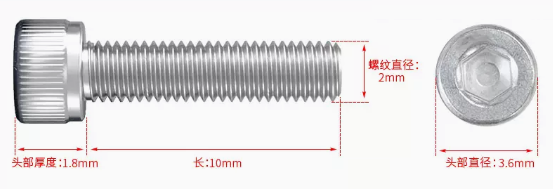
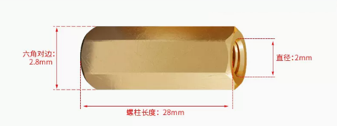
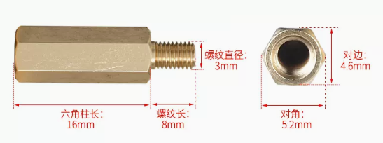
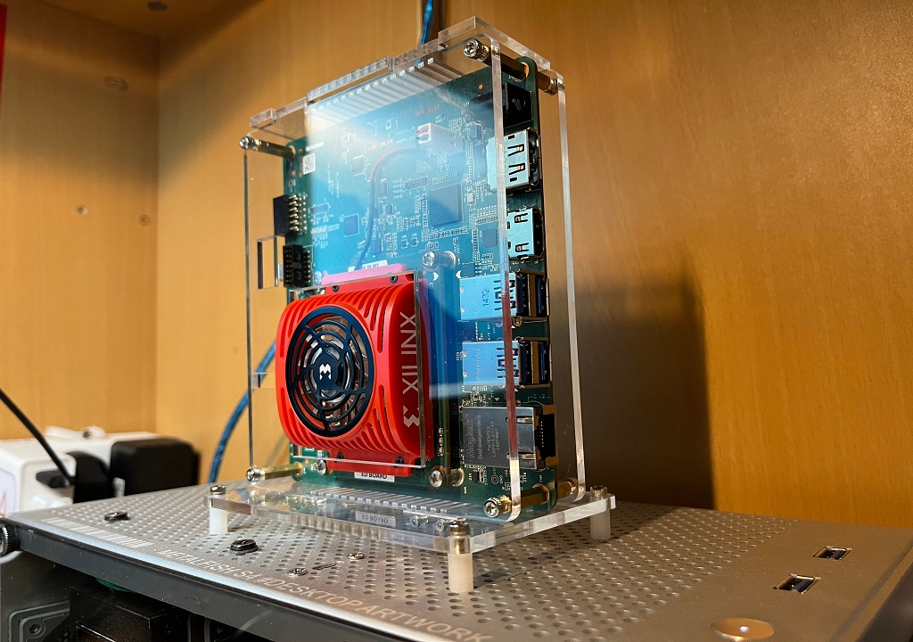
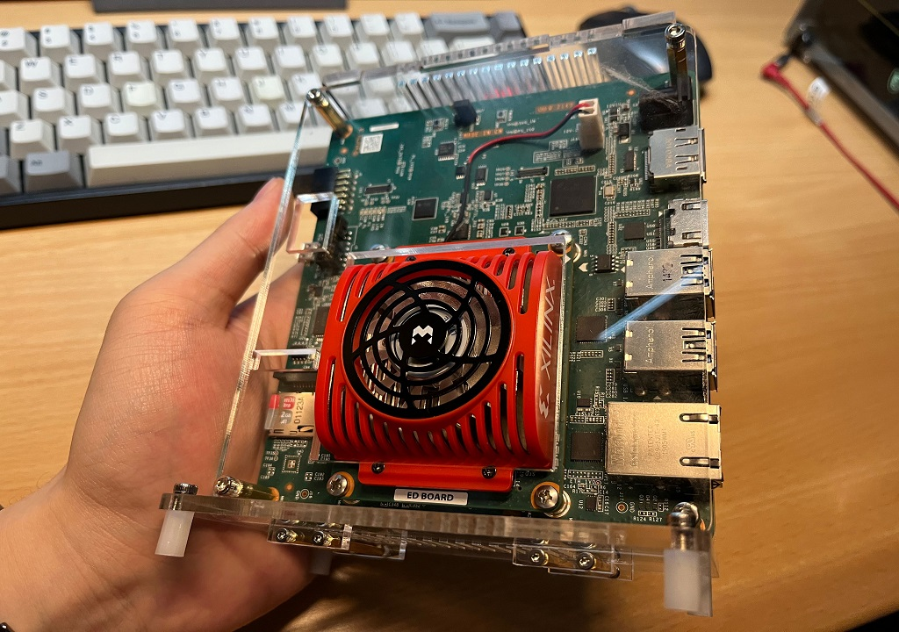

# KV260 Shell

<p align="center">

</p>

> This project is a vertical enclosure for a KV260 development board. The model is drawn using Fusion360 Education Edition, and the shell material can be 4mm acrylic or 3D printed structural parts. The overall cost of using the acrylic version can be controlled within 45RMB (20 RMB for acrylic material processing; Screw copper pillar about 20RMB)


[:star::star::star:中文本版介绍说明](./README_cn.md)


**3D model rendering**

<p align="center">
    
    
    
    
    <br>
    <sup>3D-view drawing<a href="http://https://github.com/bingxie-xpu/" target="_blank">Author:bingxie</a></sup>
</p>


## Content

1. [Description](#Description)

2. [Instruction](#Instruction)

3. [Required](#Required)

4. [Exhibition](#Exhibition)

## Description

|  **Item**  |               **Description**                | **Other** |
| :--------: | :------------------------------------------: | :-------: |
| **.media** |          Media illustration folder           | .png/.gif |
| **1.Doc**  | Details of the required copper pillar screws |   .xlsx   |
| **2.Stl**  |            3D printed model files            |   .stl    |
| **3.Dxf**  |          Acrylic plate cutting file          |   .dxf    |


## Instruction

Video Link：[【KV260系列】KV260立式亚克力外壳制作](https://www.bilibili.com/video/BV1s44y1S7Lj/?vd_source=3a0f8ef7e33855035b7b41686470a16f)

```tcl
https://www.bilibili.com/video/BV1s44y1S7Lj/?vd_source=3a0f8ef7e33855035b7b41686470a16f
```


## Required


* Acrylic sheet (or 3D printed structural parts)

​		

All DXF cutting files are in the project directory under `3. Dxf`, where `kv26_all-V2.dxf` is a two-dimensional machining diagram of all plates, as shown in the figure below. The rest of the files are 2D drawings of individual parts that you can use to build the 3D model you need.


<p align="center">
    
    <br>
    <sup>kv26_all-V2.dxf  <a href="http://https://github.com/bingxie-xpu/" target="_blank">Author:bingxie</a></sup>
</p>

Tips.  From the left to right is`top_shell`、`front_shell`、`back_shell`、`base_shell`


* The model and quantity of copper pillar screws are shown in the following table:

|         **Pattern**          |      **Name**      | **Specification** | **Number** |
| :--------------------------: | :----------------: | :---------------: | :--------: |
|   |   **内六角螺丝**   |      `M2x10`      |     8      |
|      |   **内六角螺丝**   |      `M3x8`       |     12     |
|      |  **六角双通铜柱**  |      `M2x28`      |     4      |
|      |  **六角双通铜柱**  |      `M3x11`      |     4      |
|  |  **六角单头铜柱**  |     `M3x16+8`     |     4      |
|    | **尼龙六角双通柱** |      `M3x10`      |     4      |


Tips.  ==The nylon hexagonal double-thru column is used as a base support column, this specification is not required, and the M3x11 copper column can be used instead==)


<p align="center">
    
    <br>
    <sup>kv26-structure <a href="http://https://github.com/bingxie-xpu" target="_blank">Author:bingxie</a></sup>
</p>


## Exhibition


<p align="center">
    
    
    <br>
    <sup>real-view drawing<a href="http://https://github.com/bingxie-xpu/" target="_blank">Author:bingxie</a></sup>
</p>


<p align="center">
    
    <br>
    <sup>Testing Yolo v3 Singal-person <a href="http://https://github.com/bingxie-xpu" target="_blank">Author:bingxie</a></sup>
</p>
