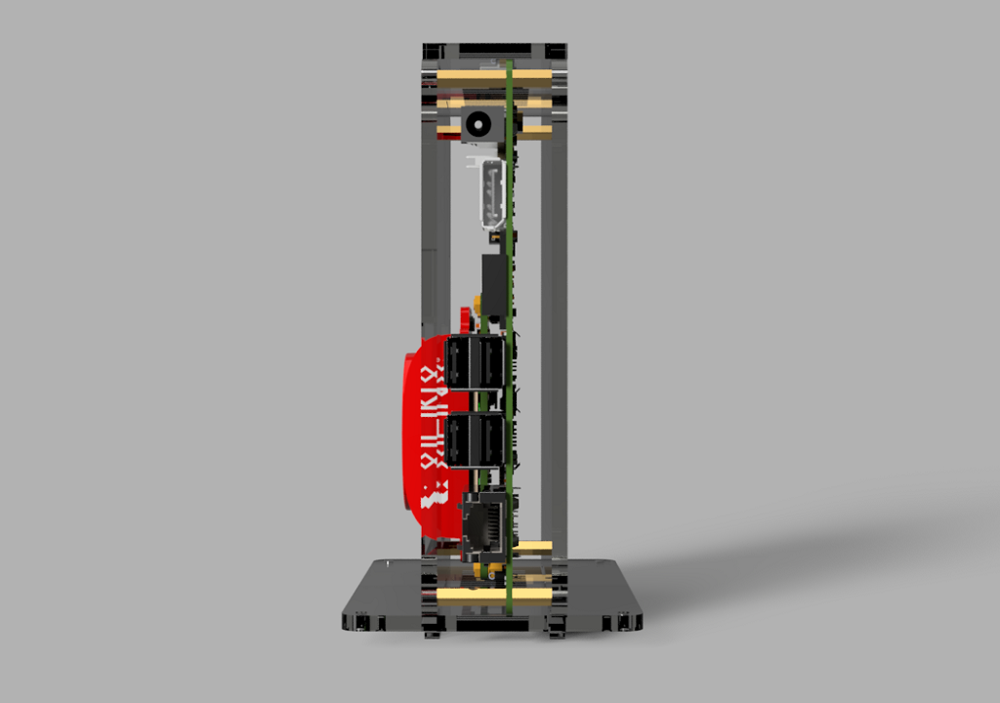
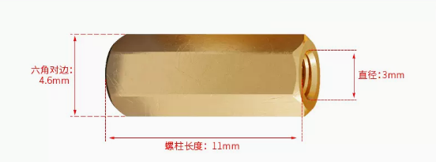
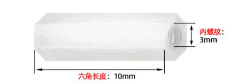

# KV260外壳

<p align="center">

</p>

> 本项目是一个KV260开发板的立式外壳。模型绘制采用Fusion360教育版绘制，外壳材料可采用4mm亚克力或者3D打印结构件。采用亚克力版本总体成本可控制在45RMB以内（亚克力材料加工20 RMB；螺丝铜柱若干约20RMB）
>


**3D模型渲染图**

<p align="center">
    
    
    
    
    <br>
    <sup>3D-view drawing<a href="http://https://github.com/bingxie-xpu/" target="_blank">Author:bingxie</a></sup>
</p>


## 目录

1. [文件说明](#文件说明)

2. [安装指导](#安装指导)

3. [所需材料](#所需材料)

4. [效果展示](#效果展示)

## 文件说明

| **文件名称** |    **文件描述**    | **其它说明** |
| :----------: | :----------------: | :----------: |
|  **.media**  |   媒体插图文件夹   |  .png/.gif   |
|  **1.Doc**   | 所需铜柱螺丝的明细 |    .xlsx     |
|  **2.Stl**   |  3D打印的模型文件  |     .stl     |
|  **3.Dxf**   |  亚克力板切割文件  |     .dxf     |


## 安装指导

视频介绍：[【KV260系列】KV260立式亚克力外壳制作](https://www.bilibili.com/video/BV1Vr4y1v76q/)

```tcl
https://www.bilibili.com/video/BV1Vr4y1v76q/
```


## 所需材料


* 亚克力板（或3D打印结构件）

​		

所有dxf切割文件均在工程目录下的3.Dxf下，其中`kv26_all-V2.dxf` 为所有板材的二维加工图，如下图所示。其余文件为各个零件的二维图纸，你可以使用它们来构建你所需的3d模型。

<p align="center">
    
    <br>
    <sup>kv26_all-V2.dxf  <a href="http://https://github.com/bingxie-xpu/" target="_blank">Author:bingxie</a></sup>
</p>

注：从左到右依次为`top_shell`、`front_shell`、`back_shell`、`base_shell`


* 铜柱螺丝型号及数量如下表所示:

|           **样式**           |      **名称**      | **规格**  | **数量** |
| :--------------------------: | :----------------: | :-------: | :------: |
|   |   **内六角螺丝**   |  `M2x10`  |    8     |
|      |   **内六角螺丝**   |  `M3x8`   |    12    |
|      |  **六角双通铜柱**  |  `M2x28`  |    4     |
|      |  **六角双通铜柱**  |  `M3x11`  |    4     |
|  |  **六角单头铜柱**  | `M3x16+8` |    4     |
|    | **尼龙六角双通柱** |  `M3x10`  |    4     |


注：==尼龙六角双通柱是作为底座支撑柱，此规格不是必须的，可使用M3x11的铜柱替代==)


<p align="center">
    
    <br>
    <sup>kv26-structure <a href="http://https://github.com/bingxie-xpu" target="_blank">Author:bingxie</a></sup>
</p>


## 效果展示


<p align="center">
    
    
    <br>
    <sup>real-view drawing<a href="http://https://github.com/bingxie-xpu/" target="_blank">Author:bingxie</a></sup>
</p>


<p align="center">
    
    <br>
    <sup>Testing Yolo v3 Singal-person <a href="http://https://github.com/bingxie-xpu" target="_blank">Author:bingxie</a></sup>
</p>
